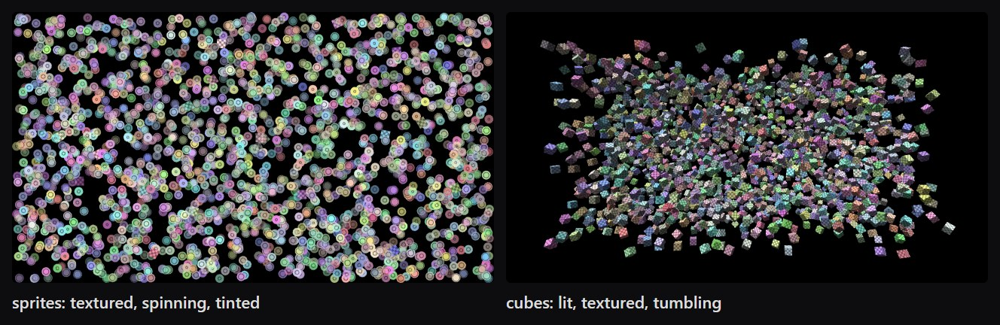

# webgl-engine-bench

How many moving sprites and 3D cubes can a web engine draw while holding 60 fps, on your machine?



*The two scenes, shown here with 2,000 objects each. Every engine draws exactly the same picture; the benchmark keeps adding objects until the engine can no longer hold 60 fps.*

**Engines compared:** LittleJS, PixiJS, Three.js and PlayCanvas, plus an extended set with Phaser, Babylon.js and the WebGPU renderers of Pixi and Three.

This benchmark was started by the author of LittleJS, so read it with that in mind. Every scene, the measurement code and the raw results are here so anyone can check them, rerun them, or improve a scene.

## Summary

On the one machine tested so far (see [RESULTS.md](RESULTS.md)), LittleJS was comparable to the fastest paths of the other engines in these tests, and faster in several. That is one machine and two simple workloads. Results on your hardware may differ, and we would like to see them: see [Submit your results](#submit-your-results).

## What it measures

- **sprites:** 24×24 textured sprites that move, spin, and have their own tint and alpha.
- **cubes:** lit, textured, tinted unit cubes that move and tumble in 3D.

Each engine draws the exact same scene from the same seeded simulation. The benchmark raises the object count until the median frame no longer holds 60 fps. It reports that count ("max N") and the engine's render CPU time per object.

Each engine is tested on its normal path and its fastest documented path. For example:
- Pixi `Sprite` and `ParticleContainer`
- Three `Mesh` and `InstancedMesh`
- LittleJS `drawTile` and `glDraw`

## How it is kept fair

- **Written independently:** the non-LittleJS scenes were written from each engine's own documentation, without looking at the LittleJS code or any results. Each was then reviewed for whether it is idiomatic and as fast as that engine intends.
- **Checked before any number counts.** The harness verifies that every scene:
  - draws the same thing, by comparing screenshots;
  - draws every object, including after the count goes down, by counting draw calls through wrappers around WebGL and WebGPU;
  - renders exactly 1280×720 at any display scale.
- **Same knowledge on every side:** all objects are always in view, everything is opaque, and tints never change. Any engine may use that, so culling and sorting are off everywhere, and static data is written once where the API allows.
- **Vsync stays on:** current Chrome ignores the flags that used to uncap the frame rate. A level passes when its median frame interval is at most max(17.5 ms, 1.5 × the display's refresh interval).
- **The shared simulation counts:** the code that moves the objects runs inside every frame for every engine, and its time is recorded separately ("sim ms"). At very high counts it takes a large share of the frame, which narrows the gaps between engines.
- **The cache wall:** above roughly 64k cubes, on a CPU with an 8 MB cache, the simulation's cost rises steeply for every engine. The instanced 3D scenes all end up near that wall. On the reference machine, the identical simulation code also ran about 0.6 ms slower per frame next to LittleJS than next to the other engines there. The cause is not known, so LittleJS's max N at the wall may be slightly understated.
- **Texture filtering is left at each engine's default, and the defaults differ.**
  - LittleJS 2D samples nearest; Pixi samples linear.
  - LittleJS 3D uses nearest magnification with mipmaps and anisotropy 4; Three uses trilinear.
- **Engine specifics:**
  - LittleJS draws through two stacked canvases (2D plus WebGL); that cost is counted.
  - The Pixi WebGPU scenes refuse to run if Pixi falls back to WebGL. Each result records which WebGPU adapter was used.
  - PlayCanvas renders on demand through `app.update` and `app.render`, which its typings mark internal. That is the only way to render exactly once per frame.
  - Babylon's `createInstance` scene uses its documented `freezeActiveMeshes` optimisation. Every cube's transform still updates every frame.
  - Phaser's fastest path (`SpriteGPULayer`) re-uploads its whole buffer each frame; that is how the layer is built.

**Think a scene isn't as fast as its engine allows?** Please open an issue or a pull request. Improvements from engine maintainers are especially welcome.

## Run it

You need Node 21+ and Chrome, on a machine that is otherwise idle.

```bash
npm install
npx playwright install chromium
npm run bench:quick    # about 5 minutes, rough numbers
npm run bench          # about 35–40 minutes, 3 repeats, the numbers to share
```

Add `--extended` to include Phaser, Babylon.js and the other WebGPU scenes, for example `npm run bench:quick -- --extended`.

To run it by hand in any browser: `npm run serve`, then open http://localhost:8121.

[RUN.md](RUN.md) has the full procedure. Please read its idle-machine checklist: keep the display awake, close other apps, and don't cover the browser window.

## Submit your results

1. Run the full benchmark. The optional label names the file:

   ```bash
   npm run bench -- --label my-laptop
   ```

2. Print a summary of your results file:

   ```bash
   npm run summary -- results/<your-file>.json
   ```

3. Open a [Submit results](../../issues/new?template=submit-results.yml) issue. Paste the summary and attach the `.json` file. Or open a pull request that adds the file to `results/` and runs `npm run results` to regenerate [RESULTS.md](RESULTS.md).

Results record your CPU, GPU, OS and browser. They never record your computer's name.

## Repository

- `scenes/`: one file per engine and variant
- `harness/`: the shared simulation, the measurement loop and the runner
- `tools/`: run, verify, summary and vendor scripts
- `vendor/`: pinned engine builds; exact versions are in `vendor/versions.json`, licences in `vendor/LICENSES/`
- `results/`: raw result files

`npm run verify` re-checks that every scene draws the same thing. `npm test` runs the unit tests.

## License

MIT; see [LICENSE](LICENSE). The vendored engines keep their own licences; see [vendor/LICENSES](vendor/LICENSES/).
